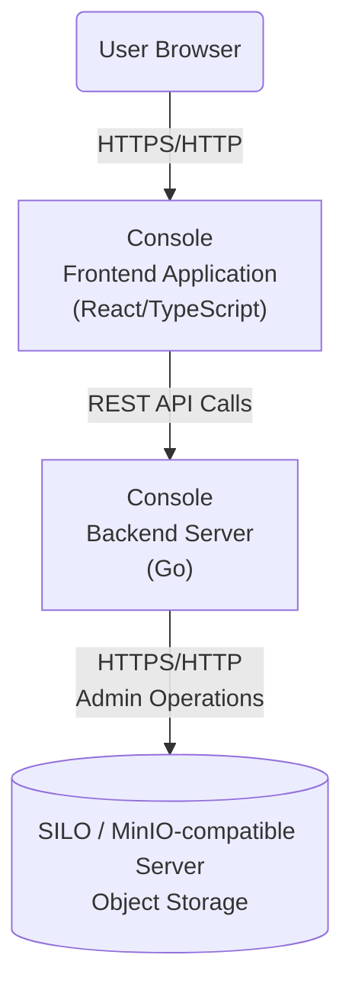

# Developing Console

SILO Console requires a SILO or
[MinIO-compatible server](https://github.com/minio/minio). For development,
run both the Console web app and the Console server.
> [!IMPORTANT]
> **MINIO** is a registered trademark of the MinIO Corporation. Consequently, this project is not affiliated with or endorsed by the MinIO Corporation.
## Console Architecture Overview


## Running Console server

Build the server in the main folder by running:

```
make
```
> [!NOTE]
> If it's the first time running the server, you might need to run `go mod tidy` to ensure you have all modules
> required.

To start the server run:

```
CONSOLE_ACCESS_KEY=<your-access-key>
CONSOLE_SECRET_KEY=<your-secret-key>
CONSOLE_MINIO_SERVER=<compatible-server-endpoint>
CONSOLE_DEV_MODE=on
./console server
```

## Running Console web app

Refer to `/web-app` [instructions](/web-app/README.md) to run the web app locally.

# Compatibility testing inside MinIO

To test Console embedded in an upstream-compatible MinIO binary, build it from
the MinIO repository as described below. This is a compatibility workflow, not
the SILO release workflow.

### 0. Building with UI Changes

If you are performing changes in the UI components of console and want to test inside the MinIO binary, you need to
build assets first.

In the console folder run

```shell
make assets
```

This regenerates the static assets served by the compatible object-storage binary.

### 1. Clone the `MinIO` repository

In the parent folder of where you cloned this `console` repository, clone the MinIO Repository

```shell
git clone https://github.com/minio/minio.git
```

### 2. Update `go.mod` to use your local version

In the MinIO repository open `go.mod` and after the first `require()` directive add a `replace()` directive

```
...
)

replace (
github.com/minio/console => "../console"
)

require (
...
```

### 3. Build `MinIO`

Still in the MinIO folder, run

```shell
make build
```

# Testing with a Container

If you want to test Console in a container, follow the steps from
`Compatibility testing inside MinIO`, but change `Step 3`
to the following:

```shell
TAG=miniodev/console:dev make docker
```

This will build a docker container image that can be used to test with.

You can use it in your local kubernetes environment aswell.

For example, if you are using kind:

```shell
kind load docker-image miniodev/console:dev
```

and then deploy any `Tenant` that uses this image
