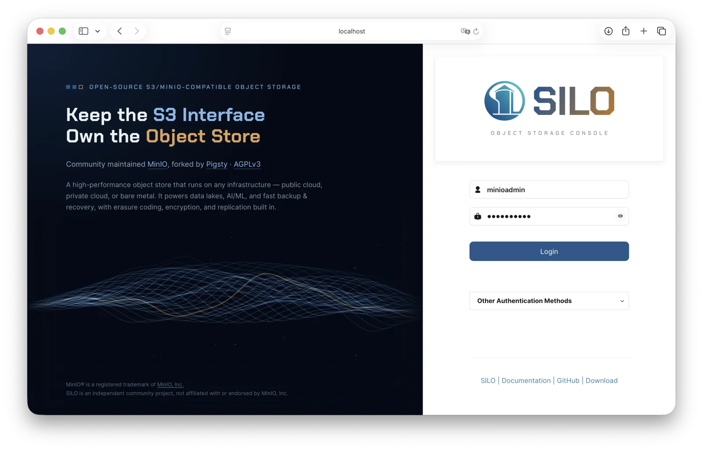
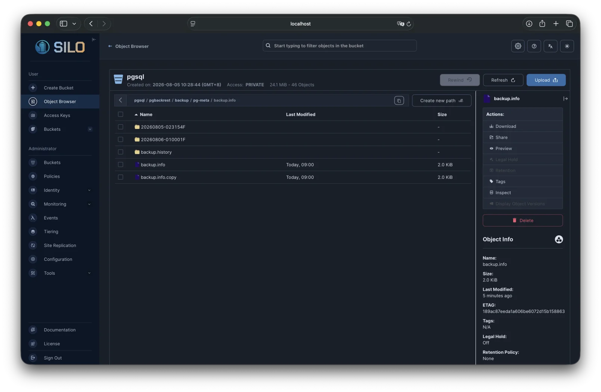
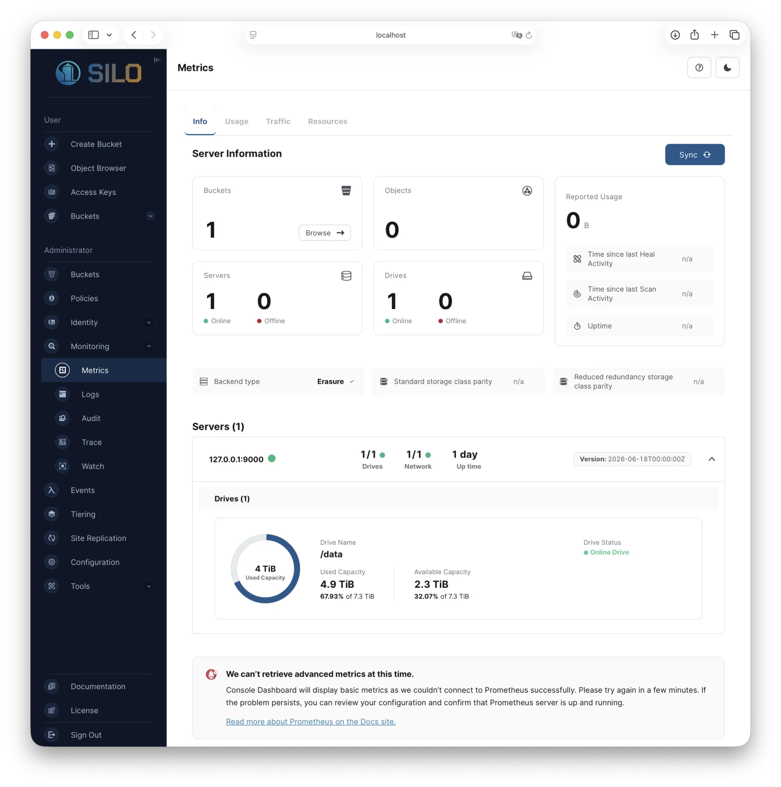

<p align="center">
  <a href="https://silo.pgsty.com/">
    
  </a>
</p>

<h1 align="center">SILO Console</h1>

<p align="center">
  <strong>Web administration console for SILO object storage</strong><br>
  Keep the interface. Own the objects.
</p>

<p align="center">
  <a href="https://silo.pgsty.com/">Website</a> ·
  <a href="https://silo.pgsty.com/docs/">Documentation</a> ·
  <a href="https://github.com/pgsty/silo-console/releases">Download</a> ·
  <a href="https://silo.pgsty.com/tags/console/">Release Notes</a> ·
  <a href="https://silo.pgsty.com/compatibility/console/">Compatibility</a> ·
  <a href="https://silo.pgsty.com/about/security/">Security</a>
</p>

<p align="center">
  <a href="https://silo.pgsty.com/"></a>
  <a href="https://github.com/pgsty/silo-console/releases/latest"></a>
  <a href="go.mod"></a>
  <a href="LICENSE"></a>
</p>

> [!IMPORTANT]
> SILO Console is an independent, community-maintained continuation of the
> former MinIO Console codebase, published by [Pigsty](https://pigsty.io/) for
> [SILO](https://silo.pgsty.com/). It is not affiliated with, endorsed by, or
> sponsored by MinIO, Inc. The MinIO name is used only to identify the upstream
> project and compatibility lineage.

## Overview

SILO Console is the browser-based administration interface for
[SILO](https://github.com/pgsty/silo). It combines a React and TypeScript web
application with a Go backend that connects to a SILO or compatible object
storage server.

The Console provides:

- dashboards, health information, logs, diagnostics, and speed tests;
- bucket, object, lifecycle, replication, notification, and tier management;
- users, groups, service accounts, policies, identity providers, and KMS setup;
- server configuration and day-to-day administrative workflows.



> [!NOTE]
> SILO Console is not a generic S3 browser. Its administrative features require
> the MinIO-compatible administration APIs implemented by SILO in addition to
> the S3 API.

## Highlights

### The full administration console

Upstream reduced its community console to an object browser. This project keeps
the complete administrative interface described above — not only object
browsing, but identity, policy, tiering, replication, and observability
management.



### Metrics V3 dashboard

The dashboard is built on **MinIO Metrics V3**, the metric set current
deployments actually scrape. All widget queries target the V3 catalog, with
guards for its zero-value and per-node export semantics, so panels distinguish a
real zero from missing data. See [`docs/metrics-v3.md`](docs/metrics-v3.md) for
the mapping.



### A refreshed interface

The sign-in page, theme system, and console chrome were reworked to current
frontend practice — one design language across matched light and dark themes,
consistent spacing and motion, and accessible focus states.

### Small, clean, and quiet

The embedded payload went from roughly 10 MB to **under 3 MB**, reproducible byte
for byte and enforced by a release gate. There is **no telemetry** — no
analytics, no beacons, no external scripts or fonts, and no call-home. Automatic
self-update is disabled, and a release catalog is contacted only when one is
explicitly configured.

### Bilingual

The entire interface, including help content and documentation links, is
available in English and Chinese behind a per-page toggle, with no added runtime
dependencies.

## Find the Right Resource

| Looking for | Canonical location |
| :-- | :-- |
| Project overview and navigation | [Silo Website](https://silo.pgsty.com/) |
| Console binaries, packages, and checksums | [GitHub Releases](https://github.com/pgsty/silo-console/releases) |
| Configuration reference | [Environment variables](docs/Environment.md) · [systemd setup](systemd/README.md) · [FAQ](docs/README.md#faq) |
| Release notes for this console | [Console release notes](https://silo.pgsty.com/tags/console/) · [`CHANGELOG.md`](CHANGELOG.md) |
| Differences from the upstream MinIO Console | [Console compatibility notes](https://silo.pgsty.com/compatibility/console/) |
| Metrics V3 dashboard mapping | [`docs/metrics-v3.md`](docs/metrics-v3.md) |
| Development setup and frontend workflow | [`DEVELOPMENT.md`](DEVELOPMENT.md) · [`CONTRIBUTING.md`](CONTRIBUTING.md) |
| Project news and security advisories | [Blog](https://silo.pgsty.com/blog/) · [release](https://silo.pgsty.com/blog/release/) and [security](https://silo.pgsty.com/blog/security/) notes |
| Bug reports and feature discussions | [GitHub Issues](https://github.com/pgsty/silo-console/issues) |
| Vulnerability reporting | [`SECURITY.md`](SECURITY.md) · [Security Policy](https://silo.pgsty.com/about/security/) |
| License, attribution, and trademark information | [`LICENSE`](LICENSE) · [`NOTICE`](NOTICE) · [`CREDITS`](CREDITS) · portal [license](https://silo.pgsty.com/about/license/), [attribution](https://silo.pgsty.com/about/attribution/), and [trademark](https://silo.pgsty.com/about/trademark/) pages |

## Related Projects

| Repository | Description |
| :-- | :-- |
| [`pgsty/silo`](https://github.com/pgsty/silo) | Silo object storage server — the S3-compatible MinIO fork this console administers |
| [`pgsty/silo-console`](https://github.com/pgsty/silo-console) | This repository — the admin web console for the Silo server |
| [`pgsty/mc`](https://github.com/pgsty/mc) | The Silo command-line client, shipped as `mcli` with the `mc` command name |
| [`pgsty/silo-pkg`](https://github.com/pgsty/silo-pkg) | Shared Go packages maintained for the Silo forks |
| [`pgsty/pigsty`](https://github.com/pgsty/pigsty) | Pigsty — the PostgreSQL distribution that ships Silo as its object storage |

## Status and Compatibility

The public project and release name is `silo-console`. Compatibility-sensitive
names are retained where changing them would break existing integrations:

| Surface | Current contract |
| :-- | :-- |
| Repository | [`pgsty/silo-console`](https://github.com/pgsty/silo-console) |
| Release binary | `silo-console` |
| Development build | `./console` |
| Go module | `github.com/minio/console` |
| Server endpoint | `CONSOLE_MINIO_SERVER` |
| Server region | `CONSOLE_MINIO_REGION` |

The retained Go module, import paths, environment variables, API fields, and
protocol identifiers are compatibility interfaces, not product branding. Any
future rename of those interfaces will require aliases and a migration period.

Standalone Console builds select the maintained SILO SDK, CLI, and shared
package through this repository's `replace` directives. Go ignores replacement
directives declared by dependency modules, so a SILO server embedding Console
source should retain the matching top-level selections:

```go
replace (
	github.com/minio/mc => github.com/pgsty/mc v0.0.0-20260826171527-70a2950478e1
	github.com/minio/minio-go/v7 => github.com/pgsty/silo-go/v7 v7.3.1
	github.com/minio/pkg/v3 => github.com/pgsty/silo-pkg/v3 v3.12.2
)
```

The logical requirements remain on resolvable upstream versions because those
requirements are part of Console's public module graph, while the replacements
select the released SILO implementations for this repository's own builds. An
upstream MinIO source build may keep the upstream versions chosen by its own
module graph. Console avoids fork-only source APIs and applies its strict
policy-write checks locally; this preserves build compatibility without
claiming that the upstream and SILO packages have identical runtime semantics.

The complete, versioned list of differences from the upstream MinIO Console —
restored features, removed features, and known gaps — is maintained in the
[compatibility notes](https://silo.pgsty.com/compatibility/console/).

## Downloads and Release Artifacts

Versioned binaries, packages, checksums, and source archives are published on
[GitHub Releases](https://github.com/pgsty/silo-console/releases).

| Artifact | Location |
| :-- | :-- |
| Source | [`github.com/pgsty/silo-console`](https://github.com/pgsty/silo-console) |
| Standalone binaries | [GitHub Releases](https://github.com/pgsty/silo-console/releases), for Linux (`amd64`, `arm64`, `armv6`), macOS (`amd64`, `arm64`), and Windows (`amd64`) |
| Linux packages | DEB, RPM, and APK for `amd64`, `arm64`, and `armv6`; packages retain the `minio-console.service` compatibility unit and `/etc/default/console` environment file |
| Checksums | `silo-console_<version>_checksums.txt` (SHA-256) alongside each release |

Automatic self-update remains disabled until signed release artifacts and a
tested rollback path are available; upgrade explicitly through a pinned binary
or package version.

## Quick Start

Install the Go version declared in [`go.mod`](go.mod), then build the standalone
Console server:

```bash
git clone https://github.com/pgsty/silo-console.git
cd silo-console
make console
```

Point it at a running SILO server and start the Console:

```bash
export CONSOLE_MINIO_SERVER=http://127.0.0.1:9000
./console server
```

Open <http://127.0.0.1:9090> and sign in with a user from the configured server.
For production, use TLS, configure stable random values for
`CONSOLE_PBKDF_PASSPHRASE` and `CONSOLE_PBKDF_SALT`, and grant users only the
permissions they need. Do not reuse the server root credentials for routine
administration.

If the server uses a region other than `us-east-1`, set the compatibility
variable as well:

```bash
export CONSOLE_MINIO_REGION=your-region
```

See the [environment variable reference](docs/Environment.md),
[systemd setup](systemd/README.md), and [FAQ](docs/README.md#faq) for additional
configuration.

### Frontend Development

The repository includes the generated frontend bundle used by the Go server.
When changing the web application, rebuild it with:

```bash
make assets
```

The required Node.js version is recorded in [`.nvmrc`](.nvmrc). See
[`DEVELOPMENT.md`](DEVELOPMENT.md) for the frontend development server and
embedded-server compatibility workflow.

## Maintenance Scope

SILO Console follows the conservative maintenance model of the SILO server. The
active line focuses on:

- compatibility with the maintained SILO server;
- applicable security and dependency updates;
- focused fixes for reproducible defects;
- release engineering, tests, documentation, and operational continuity.

Maintenance is best effort. No response time, remediation schedule, support
window, commercial support, or SLA is guaranteed. Pin versions, review changes,
keep a rollback path, and test upgrades before production use.

## Background

The upstream MinIO Console was reduced to an object browser and its community
maintenance ended. Pigsty maintains this continuation because SILO needs a
complete, reproducible administration console rather than depending on an
archived upstream line. The broader upstream changes and the fork maintenance
record are documented in these essays:

| Essay | Subject |
| :-- | :-- |
| [MinIO Is Dead](https://silo.pgsty.com/blog/post/minio-is-dead/) | Changes to the upstream project and distribution model |
| [MinIO Is Dead, Who Takes Over?](https://silo.pgsty.com/blog/post/minio-alternative/) | Alternatives considered |
| [MinIO Is Dead, Long Live MinIO](https://silo.pgsty.com/blog/post/minio-resurrect/) | Establishing the server and client release pipeline |
| [Two months into maintaining a MinIO fork](https://silo.pgsty.com/blog/post/minio-promise-kept/) | Initial security and maintenance work |

## Security and Contributing

Report security issues privately as described in [`SECURITY.md`](SECURITY.md).
For ordinary defects and feature work, open an
[issue](https://github.com/pgsty/silo-console/issues) or follow
[`CONTRIBUTING.md`](CONTRIBUTING.md). Useful contributions include security and
dependency updates, compatibility fixes, tests, release automation,
documentation, and accessibility improvements.

## License, Attribution, and Trademarks

SILO Console is free software distributed under the
[GNU Affero General Public License v3.0 or later](LICENSE). See [`NOTICE`](NOTICE)
and [`CREDITS`](CREDITS) for notices and third-party license information.

This repository contains code derived from the former MinIO Console and carried
forward through the [`Alevsk/console`](https://github.com/Alevsk/console) and
[`georgmangold/console`](https://github.com/georgmangold/console) community
maintenance lines. Copyright in inherited code remains with MinIO, Inc. and the
respective contributors; SILO-specific modifications remain copyright their
respective authors. Existing copyright, license, and attribution notices must
be kept intact.

MinIO® is a registered trademark of MinIO, Inc. SILO and SILO Console are
independent community projects and are not affiliated with, endorsed by, or
sponsored by MinIO, Inc. Amazon S3 is a trademark of Amazon.com, Inc. or its
affiliates; references to S3 describe protocol compatibility only. All other
trademarks are the property of their respective owners.
